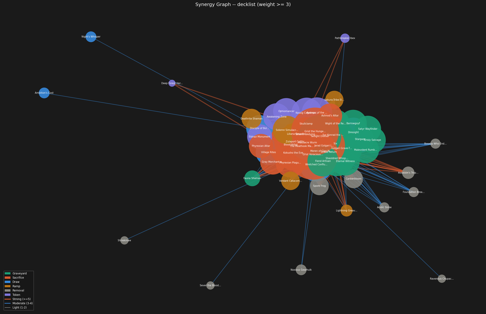

# EDH Synergy Graph Analyzer

A tool for analyzing synergies between cards in a Commander (EDH) deck. It fetches oracle tags from [Scryfall](https://scryfall.com), scores card interactions using a user-defined synergy table, and produces an interactive graph and a scored CSV export.

This project was built collaboratively with [Claude](https://claude.ai), Anthropic's AI assistant, which wrote or refined parts of the code.



---

## How it works

1. **Load** a decklist from a CSV, plain text file, or Archidekt URL
2. **Fetch** EDHREC rank and oracle tags for each card from the Scryfall API (~50–80 requests per unique deck, results cached)
3. **Score** card pairs by matching tags against a synergy rule table
4. **Export** a scored CSV and render a synergy graph

On first run the tag data is saved to a cache file (`<deckname>_tags.json`). Subsequent runs load from cache instantly with zero API calls. Delete the cache file to force a re-fetch (e.g. after adding new cards or updating the synergy table).

---

## Installation

Python 3.10+ is required.

```bash
git clone https://github.com/yourname/edh-synergy
cd edh-synergy
python3 -m venv venv
source venv/bin/activate      # Windows: venv\Scripts\activate
pip install -r requirements.txt
```

**requirements.txt**
```
requests
networkx
matplotlib
```

---

## Usage

### Basic

```bash
python edh_synergy.py
```

Uses `decklist.csv` and `synergy_tags.csv` from the current directory.

### With a different decklist

```bash
# CSV file
python edh_synergy.py --decklist my_deck.csv

# Plain text file (exported from Moxfield, EDHREC, MTGGoldfish, Arena etc.)
python edh_synergy.py --decklist my_deck.txt

# Archidekt deck ID
python edh_synergy.py --decklist 365563

# Archidekt URL
python edh_synergy.py --decklist "https://archidekt.com/decks/365563"
```

### All options

| Flag | Default | Description |
|---|---|---|
| `--decklist` | `decklist.csv` | Decklist source: CSV, text file, or Archidekt ID/URL |
| `--tags` | `synergy_tags.csv` | Synergy rule table CSV |
| `--cache` | `<deckname>_tags.json` | Tag cache file (auto-named if omitted) |
| `--no-fetch` | off | Skip API calls; use existing cache only |
| `--min-weight` | `3` | Minimum edge weight to show in graph |
| `--archetype` | none | Filter graph to one archetype (e.g. `aristocrats`) |
| `--top` | `15` | Number of top cards/edges to print |
| `--power-weight` | `0.4` | Weight of EDHREC power score in combined score (0–1) |
| `--export-edges` | off | Also export all synergy edges to `<deck>_edges.csv` |
| `--no-display` | off | Save PNG without opening a window |

---

## Input formats

### CSV decklist (`decklist.csv`)

```csv
name,category
Meren of Clan Nel Toth,graveyard
Phyrexian Altar,sacrifice
Blood Artist,sacrifice
Sol Ring,ramp
```

The `category` column is optional. If omitted, categories are automatically inferred from Scryfall tags. Valid categories are: `graveyard`, `sacrifice`, `draw`, `ramp`, `removal`, `token`, `other`.

### Plain text decklist

Standard format used by most MTG deck editors:

```
// Creatures
1x Meren of Clan Nel Toth
1x Blood Artist
1 Phyrexian Altar

// Lands
Overgrown Tomb
```

Quantity prefixes (`1x`, `4 `) and set codes (`(MH3)`) are stripped automatically. Lines starting with `//` or `#` are treated as section headers and skipped. Each card is only counted once regardless of quantity.

---

## Synergy table (`synergy_tags.csv`)

The synergy table defines which pairs of Scryfall oracle tags represent meaningful synergies. Each row is a rule:

```csv
tag_a,tag_b,weight,label,archetype
sacrifice-outlet,death-trigger,3,sacrifice engine core,aristocrats
mill,recursion,3,mill then recur,graveyard
repeatable-token-generator,sacrifice-outlet,2,tokens as fodder,aristocrats
```

| Column | Description |
|---|---|
| `tag_a` | First Scryfall oracle tag |
| `tag_b` | Second Scryfall oracle tag (can equal `tag_a` for stacking effects) |
| `weight` | Synergy strength: 1 (light), 2 (moderate), 3 (strong) |
| `label` | Human-readable description shown in output |
| `archetype` | Broad deck archetype — used for `--archetype` filtering |

A rule fires when one card has `tag_a` and another has `tag_b` (or vice versa). If both cards share both tags, a reduced stacking weight is also added. Edge weights accumulate across all matching rules.

Tag names must be valid Scryfall oracle tags. A full list of functional tags is available in `scryfall_functional_tags.txt`. You can also verify tags at [scryfall.com/docs/tagger-tags](https://scryfall.com/docs/tagger-tags).

A comprehensive `synergy_tags.csv` covering 14 Commander archetypes is included in this repository.

---

## Outputs

### Scores CSV (`<deckname>_scores.csv`)

Exported automatically after every run.

| Column | Description |
|---|---|
| `name` | Card name |
| `category` | Category (from CSV or inferred from tags) |
| `synergy_score` | Raw sum of all edge weights |
| `connection_count` | Number of cards with any synergy connection |
| `edhrec_rank` | EDHREC rank from Scryfall (lower = more played) |
| `power_score` | Normalised 0–1 power score (higher = better) |
| `combined_score` | Weighted average of synergy and power scores |
| `tags` | Pipe-separated list of matched Scryfall tags |

The `combined_score` weights synergy and power according to `--power-weight` (default 0.4 power, 0.6 synergy). Both synergy and power are normalised to 0–1 before combining.

### Synergy graph (`<deckname>_synergy.png`)

A force-directed graph where:
- **Node size** scales with synergy score
- **Node colour** reflects card category
- **Edge colour** reflects synergy strength (red = strong ≥5, blue = moderate 3–4, grey = light 1–2)
- **Edge thickness** scales with weight

### Edges CSV (`<deckname>_edges.csv`)

Exported with `--export-edges`. Contains every detected synergy pair with accumulated weight and the list of rules that fired.

---

## Extending the synergy table

To add support for a new archetype or fix missing synergies:

1. Look up the relevant oracle tags in `scryfall_functional_tags.txt` or at `scryfall.com/docs/tagger-tags`
2. Add rows to `synergy_tags.csv`
3. Delete the tag cache (`<deckname>_tags.json`) so new tags are fetched on the next run

To check what tags Scryfall has assigned to a specific card, use the included diagnostic tool:

```bash
python check_tags.py "Meren of Clan Nel Toth" "Blood Artist"
```

---

## Files

| File | Description |
|---|---|
| `edh_synergy.py` | Main script |
| `check_tags.py` | Diagnostic tool for checking card tags |
| `synergy_tags.csv` | Synergy rule table (14 archetypes, 269 rules) |
| `scryfall_functional_tags.txt` | Complete list of Scryfall functional oracle tags |
| `decklist.csv` | Example decklist (Meren of Clan Nel Toth) |
| `requirements.txt` | Python dependencies |

---

## Notes

- This tool uses the [Scryfall API](https://scryfall.com/docs/api). Please be respectful of their rate limits — the script already includes delays between requests.
- Oracle tags are a community project maintained by Scryfall's Tagger tool. Tag coverage varies — newer or obscure cards may have fewer tags.
- EDHREC rank data comes from Scryfall's card objects and reflects format-wide popularity rather than power level in a specific deck.
- This project is unofficial and not affiliated with Scryfall, EDHREC, or Archidekt.
